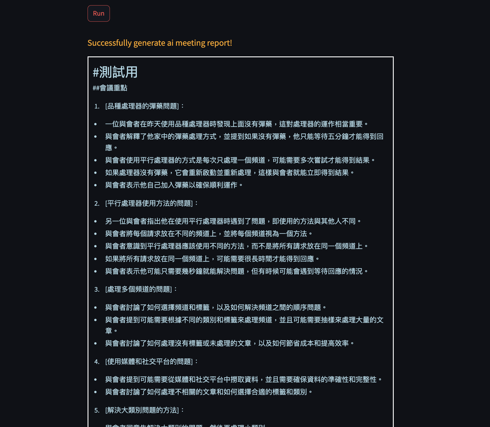

# AI Automation Meeting

## 📌 Overview

- This project automates meeting minutes. It automatically converts recorded audio files into text, then uses a language model for text summarization and analysis, and finally generates a summary report of meeting minutes.

- The speech-to-text we use is based on openai model whisper. It also supports downloading models and calling OpenAI API. You can choose models of various sizes according to your needs. If you want to use the API, please pay attention to the fees.

- We use the OpenAI API for the model used to generate text. You can perform the generation operation based on currently publicly available language models. Meeting AI will automatically perform optimal calculations based on the maximum number of tokens available and perform Map Reduce operations on meeting records to the greatest extent. , so the effect of the selected model type will be different. The supplement is the model strength, which is also related to the max token limit.

## 📌 Project Structure

```
.
├── README.md
├── api.py
├── image
│   └── ai record man.jpg
├── load_models.py
├── requirements.txt
├── src
│   ├── ai_meeting_generator.py
│   ├── auto_summarize.py
│   ├── export_records.py
│   ├── speech_to_text.py
│   └── whisper_model
│       ├── base.pt
│       ├── medium.pt
│       ├── small.pt
│       └── tiny.pt
├── streamlit.py
└── test
    ├── test_auto_summarize.py
    ├── test_export_records.py
    └── test_speech_to_text.py
```

## 📌 Setup

- Clone project

```bash
git clone git@github.com:Lucien1999s/ai-meeting-project.git
```

- Install requirements

```bash
pip install -r requirements.txt
```

- It also requires the command-line tool ffmpeg to be installed on your system, which is available from most package managers:

```bash
# on Ubuntu or Debian
sudo apt update && sudo apt install ffmpeg

# on Arch Linux
sudo pacman -S ffmpeg

# on MacOS using Homebrew (https://brew.sh/)
brew install ffmpeg

# on Windows using Chocolatey (https://chocolatey.org/)
choco install ffmpeg

# on Windows using Scoop (https://scoop.sh/)
scoop install ffmpeg
```

- Load the audio model to the local end and save it in src/whisper_model:

```bash
# download all models
python3 load_models.py --model all

# download each model
python3 load_models.py --model tiny

python3 load_models.py --model base

python3 load_models.py --model small

python3 load_models.py --model medium
```

- Set up your OpenAI API key in .env

```bash
API_KEY = "sk-..."
```

## 📌 Quick Start

### Usage of AI Meeting Generator

```python
import os
import logging
from dotenv import load_dotenv
from src.ai_meeting_generator import run

load_dotenv()

report = run(
    meeting_name="Team Meeting", 
    file_path="/path/to/audio/file.wav", 
    api_key=os.getenv("API_KEY"),  
    audio_model="base", 
    text_model="gpt-3.5-turbo",
    output_path="/path/to/output",
    transcript_path="/path/to/transcript.txt",
    save_transcript=True,
    show_txt_cost=True,
    logging_level = logging.INFO
)
```

### Launch with Streamlit

```bash
streamlit run streamlit.py
```

#### ✓ Demo

<div>
    
    
</div>


### Parameter Description

| Parameter | Type | Default Value | Purpose |
| --- | --- | --- | --- |
| meeting_name | str | None | The name of the meeting |
| file_path | str | None | The path to the audio file of the meeting |
| api_key | str | None | The API key for OpenAI |
| audio_model | str | "base" | The model to be used for audio transcription |
| text_model | str | "gpt-3.5-turbo" | The model to be used for text generation |
| transcript_path | str | None | The path where the transcript can be read from, and there's no need to use the SpeechToTextConverter Class |
| output_path | str | None | The path where the output files should be saved |
| save_transcript | bool | False | If True, the transcript will be saved to the output path |
| show_txt_cost | bool | False | If True, the cost of text generation will be shown |
| logging_level | int | logging.INFO | The level of logging to be used |

### Available Models for Selection

| Model | Link of Tutorial |
| --- | --- |
| audio_model | [whisper-github](https://github.com/openai/whisper "link") |
| text_model | [openai-models](https://platform.openai.com/docs/models "link") |

### Cost of Generating Reports

The following is the information you can get in the .json file, which includes the number of tokens spent and the length of the audio file of the transcribed speech. 

You can calculate the real cost based on this cost information and the price charged by the model. You can view the detailed price:[openai-prices](https://openai.com/pricing "link")

```json
{
    "meeting_name": "...",
    "summary": "...",
    "usage": {
        "audio cost": {
            "audio model": "api",
            "audio minutes": 65
        },
        "text cost": {
            "text model": "gpt-3.5-turbo",
            "prompt tokens": 48511,
            "completion tokens": 18133
        }
    }
}
```

## 📌 Testing

Not completed yet, please wait...
